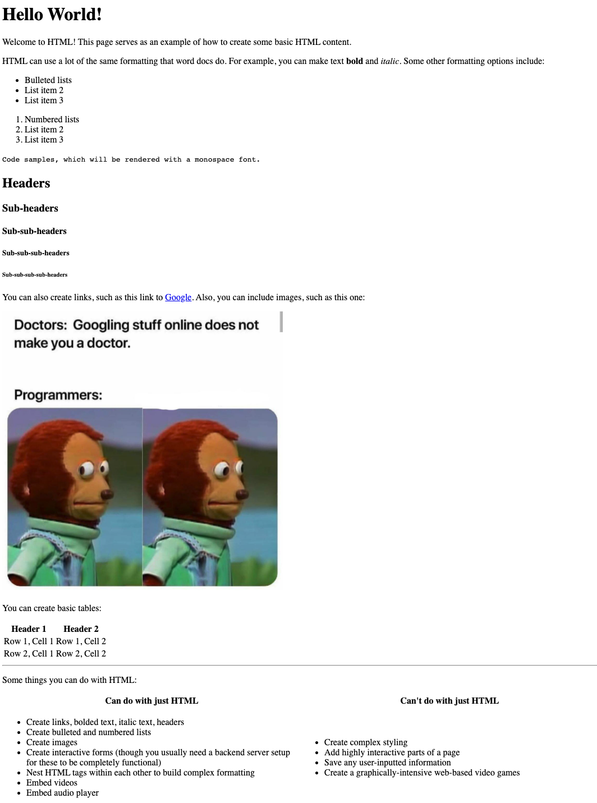

# HTML Basics

The goal here is to test your knoweldge of HTML and see what's possible using only HTML. The assignment is to create this page using HTML:

[Source for the programmer meme](https://www.reddit.com/r/ProgrammerHumor/comments/covgb5/lamo/)
