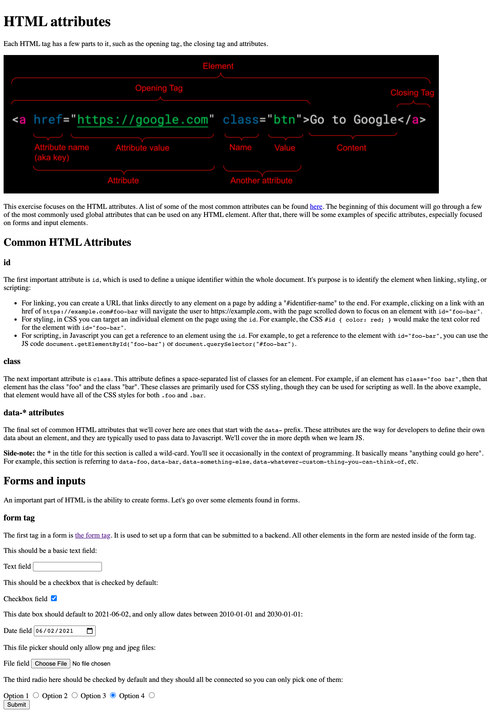

# HTML Attributes

This exercise focuses on the HTML attributes and see what's possible using only HTML. The assignment is to create this page using HTML:

[HTML anatomy](./anatomy-of-an-html-tag.png)
[HTML Attributes](https://developer.mozilla.org/en-US/docs/Web/HTML/Attributes)
